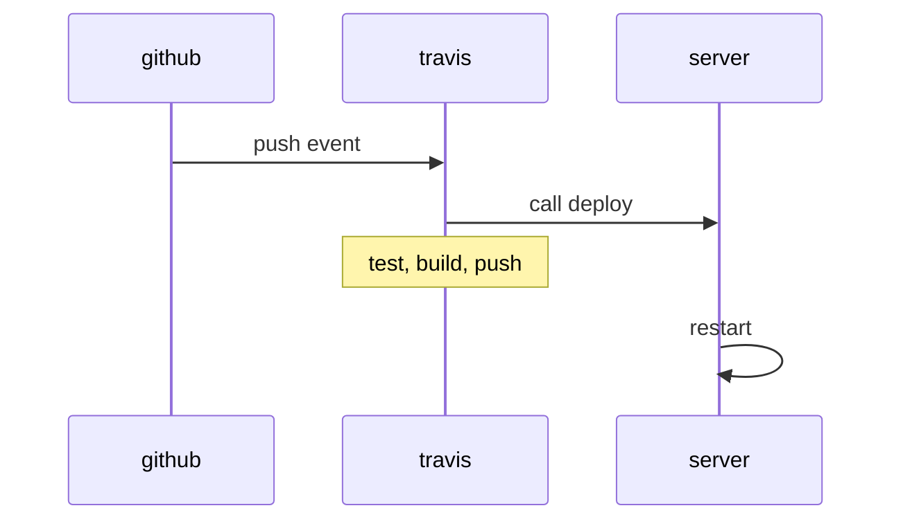

很久没有正式更新了，一直希望能出一些文章，但是一方面技术水平不够，另一方面之前工作也忙。最主要还是懒吧。那么就从这篇比较简单的文章开始重新写作。

------------------------

由于我自己维护了两个项目，花了一些钱，所以对省钱这部分略有心得。

关于 CI/CD 的意思，分别是持续集成和持续部署。
持续集成阶段所完成的工作应该是代码写完后到上线见所做的绝大部分工作，例如 lint 检查，执行单元测试，集成测试等步骤。
持续部署是自动地部署项目，代码完成后经过一些测试流程就可以发布给用户。

以下是一个穷人版的方案，如果你能理解下图，那么可以关闭这篇文章了。



原理上是通过两个关键的免费服务：[travis ci](http://travis-ci.org) 和 [aliyun 容器镜像](https://www.aliyun.com/product/acr) 来实现。

## 代码编写

首先完成自己的功能代码，并编写相应的测试用例。条件允许的情况下可以做一些简化命令行的操作，例如写个 makefile。

那么在本文中的例子是 golang 项目。测试命令为 `go test ./...`

## aliyun 容器

我个人之前用的七牛云的镜像服务，体验非常不好，经过工单沟通发现现在已经不再对外提供服务了。所以换了阿里云的免费镜像服务，那么进入到 [管理后台](https://cr.console.aliyun.com/cn-hangzhou/instances/credentials) 设置固定密码，开个镜像仓库。


## travis CI

接下来需要集成 travis ci。它本身和 github 集成地特别好，而且对 public 仓库免费，是*穷人*的项目首选。

travis ci 基本上分为几个阶段：初始化，脚本，部署。

```yml
language: go
sudo: required

go:
- 1.14

env:
  global:
    - CGO_ENABLED=0
    - GOOS=linux
    - GOARCH=amd64

services:
  - docker
  - postgresql
  - redis-server

go_import_path: github.com/clippingkk/clippingkk-api

before_script:
  # 初始化数据库
  - psql -c 'create database clippingkk;' -U postgres
  # - 执行数据库 migration
  - docker run -v ${TRAVIS_BUILD_DIR}/db/migrations:/migrations --network host migrate/migrate -path=/migrations/ -database postgres://postgres:@localhost:5432/clippingkk up

script:
  # 测试
  - go test -tags ci -v ./...
  # 生成环境配置文件写入
  - echo ${CONFIG_RELEASE} | base64 -d > config/config.release.go
  # 生产环境打包
  - make release

before_deploy:
  - docker login registry.cn-shanghai.aliyuncs.com -u ${ALIYUN_USERNAME} -p ${ALIYUN_PWD}
  - export TRAVIS_TAG=${TRAVIS_TAG:-$(date +'%Y%m%d%H%M%S')-$(git log --format=%h -1)}
  - docker build -t registry.cn-shanghai.aliyuncs.com/annatarhe/clippingkk:v${TRAVIS_TAG} .
  - docker push registry.cn-shanghai.aliyuncs.com/annatarhe/clippingkk:v${TRAVIS_TAG}
  # 私钥写入 ci 机器（务必是一个无用的私钥）
  - echo ${QCLOUD_USER_PK} | base64 -d > ~/.ssh/id_rsa
  - chmod 600 ~/.ssh/id_rsa

install:
  - echo ${SERVER_HOST} >> $HOME/.ssh/know_hosts

deploy:
  provider: script
  skip_cleanup: true
  # 登陆服务器：停止服务，更换镜像，启动服务
  script: ssh travis@${SERVER_HOST} -o StrictHostKeyChecking=no 'fish clippingkk-deploy.fish ${TRAVIS_TAG}'
  on:
    tags: true
```

脚本中用到了一些环境变量。都需要在 `https://travis-ci.org/clippingkk/clippingkk-api/settings` 的 **Environment Variables** 中新增


## Server

目标服务器需要创建一个 ci 账户用以给打包机登陆，还需要提供一个有内容的执行脚本完成服务的重启。

```fish
#!/usr/bin/fish
cd /home/annatarhe/sites/clippingkk-api/

echo "run docker-compose down"
docker-compose down
sed -i 
"s/registry\.cn-shanghai\.aliyuncs\.com\/annatarhe\/clippingkk:.*/registry\.cn-shanghai\.aliyuncs\.com\/annatarhe\/clippingkk:v$argv/" docker-compose.yml
sleep 1s
echo "docker-compose up"
docker-compose up -d api-server
docker-compose up -d api-server
```

这个脚本即为 travis-ci.yml 中提供的 `clippingkk-deploy.fish` 其中参数为 tag id 用以发布。可以看到主要是修改了 docker-compose.yml 中关于镜像版本一行的内容。

从此，你的项目会在新 tag 被推送到 github 后自动部署应用。缺了滚动更新，对于小项目来说暂时够用。

## 后记

目前这套方案已经稳定运行半年有余，有了十几个版本号


如果你也厌倦了重复的 build, scp, down & up. 可以试试这套简单的方案。
